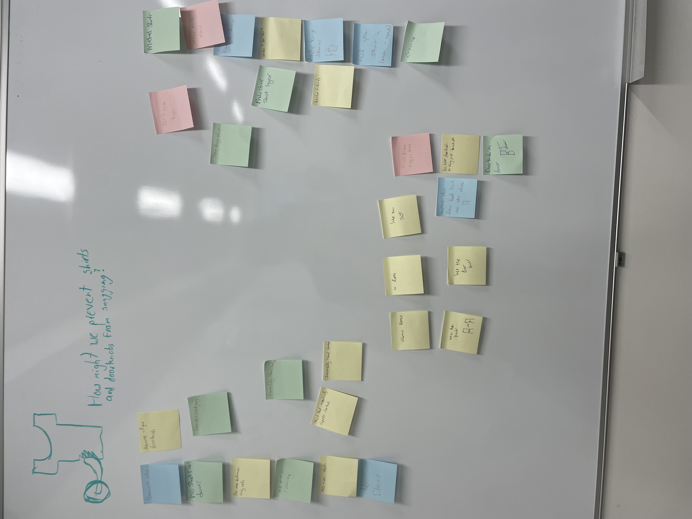
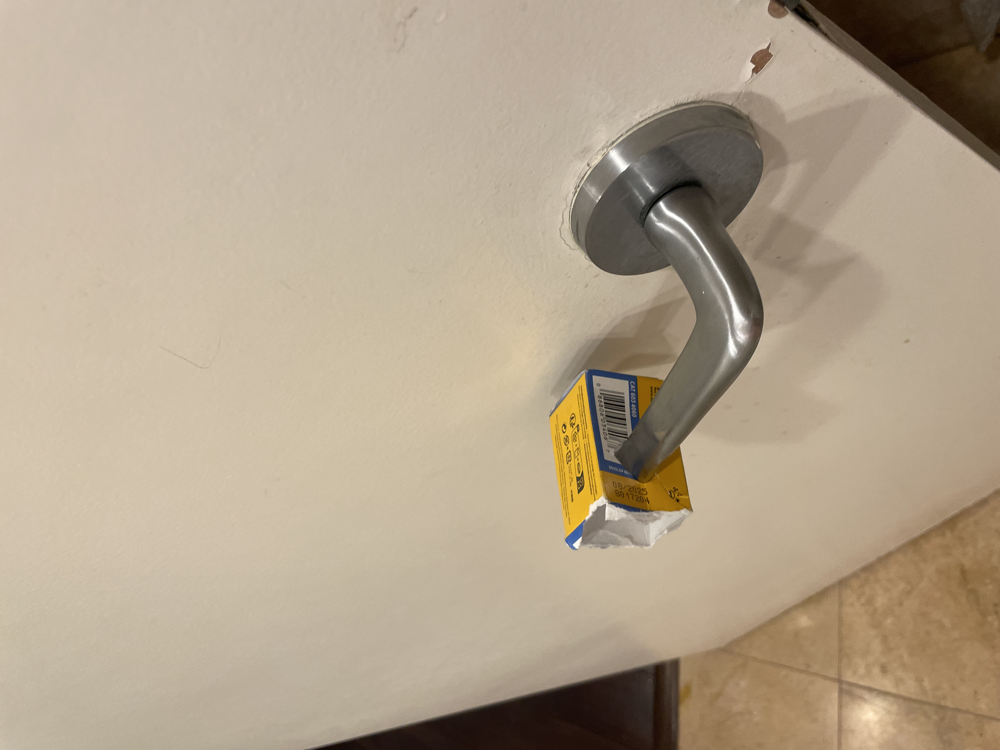

# Design Thinking Reflection

## Step 1: Needfinding

Needfinding was a fun activity, but it was difficult to think of small annoyances in our lives that were worthy of a new solution. It was challenging to find a middle ground between a need that was too large to tackle and a need that was too frivolous to be worthy of catering to. It was fun making the drawings, though, and the creative aspect was great. You don’t often see the creative side of technical fields, so I really enjoyed the little artistic venture that came with this step. Knowing what I know now, I think finding needs that we can design solutions for will be more natural and easier in the future 

## Step 2: Defining

This step had the largest learning curve of any of the steps in my opinion. It was difficult initially to get the ball rolling and to think creatively, but after my first few ideas, everything started to just flow. I do plan on being a little more serious with the ideas in the future as I went a little overboard with the creativity, but all in all I think there was value in some of the joking responses. Thinking of solutions as a whole was a great time, and while difficult, I really did enjoy this step.

Image of my idea board

## Step 3: Ideating

Sorting through all of my own ideas as well as my classmates was the most difficult part of the process for me. There were so many great ideas, but a lot of them weren’t feasible, or had too many complications. Additionally, no idea was perfect on its own, and finding a mix between different aspects of different ideas was tough for me. It was fun to narrow everything down and start sketching out a final plan, but that also meant that I had to lose some of the creativity in the steps before, and focus on a more serious plan. In the future, I think I need to focus more on the idea that no solution will ever be perfect, and we figure out what works and what doesn’t through trial and error. I was so honed in on a one and done solution, but when it came to actual prototyping, I realized I had to try a few solutions before I found what I really liked. 

## Step 4: Prototyping

I absolutely loved this step. For me, it was a perfect mix between creativity and technical skills, and I thoroughly enjoyed the challenges that came with making my own creations. While it was difficult to use a limited supply of resources, figuring out how to create what I wanted to do despite not having the materials I wanted was part of the fun. My solutions turned out much rougher than I first sketched, but I think that's the beauty in prototyping. Similar to the ideating stage, I wish I had known that no one solution could ever be perfect, but I quickly learned in the actual modeling that making rough prototypes wasn’t as intensive of a process as I thought, and I could try a few concepts I liked. The process as a whole was great and really got my mind turning, and while my models aren’t pretty, I have a lot of insight now when it comes to design thinking. 

Image of prototype - mother thought the ones I made in school were trash so I improvized with a box I had on hand
